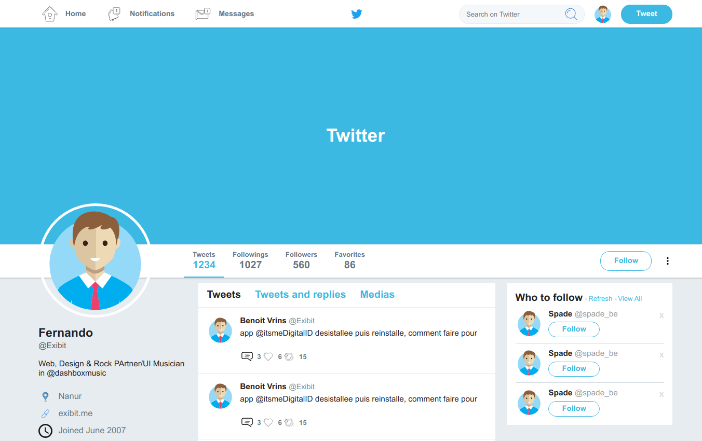

<h1>Twitter-clonep</h1>

## 🚀 Tecnologias

Esse projeto foi desenvolvido com as seguintes tecnologias:

- [Html5]
- [CSS]

## 💻 Projeto

Projeto clone Twitter básico da págino do perfil.

## 🔖 Layout

## Licença

Esse projeto está sob a licença MIT.

